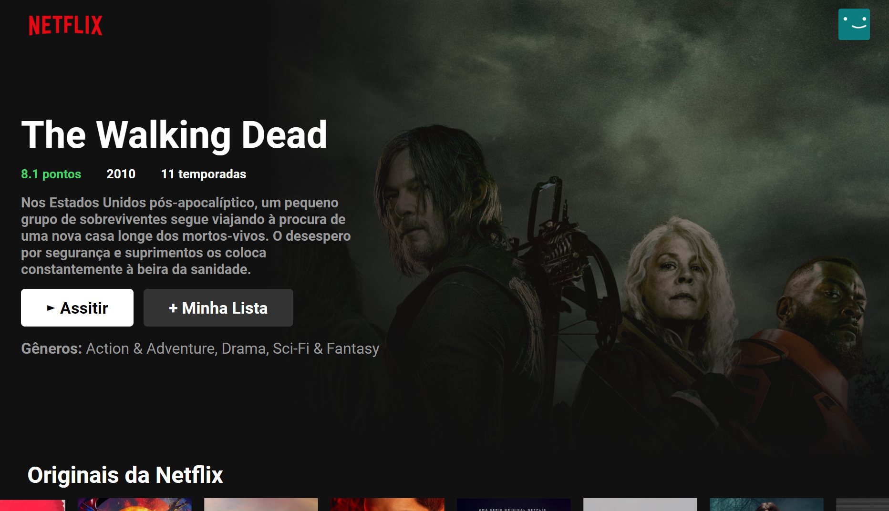

# Clone NetFlix

Projeto one page Netflix criado com React Js.

### Tecnologias utilizadas :
<ul text-align='center'>
  <li>API - TheMovieDb</li>
  <li>React js</li>
  <li>CSS</li>
  <li>Material UI</li>
</ul>

<a href="https://samaelmelo.github.io/clone-netflix" target="_blank">Visualizar __app__</a>